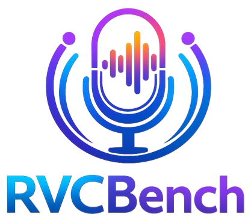
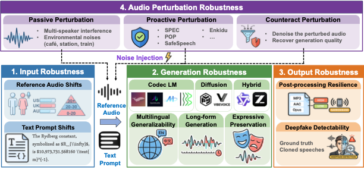

#  RVCBench

**RVCBench** is an open benchmark for studying how robust modern voice cloning systems are against audio protection methods.



RVCBench gives you an end-to-end, reproducible pipeline to:
- apply protection to source prompts (SafeSpeech, Enkidu, EM, noise/spec perturbations),
- run voice cloning adversaries on clean or protected inputs,
- optionally denoise protected audio and re-evaluate,
- report fidelity and generation quality metrics.

## Why RVCBench

- Compare protection vs. cloning under one consistent framework.
- Reproduce runs with Hydra-based configs instead of one-off scripts.
- Extend quickly with your own datasets, methods, and adversary wrappers.
- Get structured outputs (`metrics.json`) that are easy to aggregate.

## Who It Is For

- Researchers benchmarking anti-voice-cloning defenses.
- Engineers evaluating attack/defense tradeoffs on new models.
- Contributors who want a common baseline for robust VC evaluation.

## Repository Layout

- `run_protect.py`: generate protected audio and evaluate fidelity.
- `run_vc.py`: run VC on clean prompts.
- `run_vc_protect.py`: run VC on protected prompts.
- `run_denoiser.py`: denoise protected audio and evaluate fidelity.
- `configs/`: Hydra configs for datasets, models, protection, VC, and denoising.
- `src/`: core modules (datasets, protection, adversaries, workflows, evaluation).
- `data/`: local data folders and manifests used by experiments.

## Dataset

We are currently preparing to release our dataset on Hugging Face.

Until then, you can download it here:

👉 **[Download the dataset](https://drive.google.com/file/d/1ZDOMorDGV8i5oVNtA5BaJLbFj2dVo5AU/view?usp=drive_link)**

## Setup

Create a Python environment with `PyTorch`, `torchaudio`, and `hydra-core`, then add model-specific dependencies based on the configs you plan to run.

Model checkpoints and third-party components are not bundled and must be downloaded separately.

- SafeSpeech reference code is under `src/protection/safespeech/original_code/`.
- SafeSpeech model downloads are handled by:

```bash
python src/protection/safespeech/original_code/download_models.py
```

- Some wrappers expect local paths like `checkpoints/` or `model/`; verify each config under `configs/`.

## 5-Minute Start

If you only want to verify your setup quickly, run:

```bash
python run_vc.py --config-name ozspeech_ots vc.max_samples=5
```

Then check `results/<run_name>/<timestamp>/metrics.json`.

## Quickstart

All entrypoints use Hydra. You can override config values directly from the command line.

1. Generate protected audio and compute fidelity:

```bash
python run_protect.py --config-name safespeech_on_libritts
```

2. Run VC on clean prompts:

```bash
python run_vc.py --config-name ozspeech_ots
```

Example dataset-specific config:

```bash
python run_vc.py --config-name ots_vc/clean/vctk/bert_ots
```

3. Run VC on protected prompts:

```bash
python run_vc_protect.py --config-name ots_vc/protection/safespeech/ozspeech_ots \
  protected_audio_dir=results/safespeech_on_libritts/<timestamp>/protected_audio
```

4. Optionally denoise protected audio:

```bash
python run_denoiser.py --config-name denoise/denoiser_dns64_on_protected_libritts_spec
```

## Experiment Flow

`protect -> vc_protect -> (optional) denoise -> evaluate`

This makes it easy to compare clean, protected, and recovered performance under a single framework.

## Configuration Notes

- Dataset settings: `configs/dataset/` (`root_path`, `sampling_rate`, etc.).
- VC settings: `configs/ots_vc/` (clean/protected splits and model variants).
- Most model/checkpoint paths are defined in config fields such as `adversary.code_path` and `checkpoint_path`.

Example override:

```bash
python run_vc.py --config-name ozspeech_ots vc.max_samples=50 dataset.root_path=/path/to/data
```

## Outputs

Each run writes to:

```text
results/<run_name>/<timestamp>/
├── generated_audio/
├── protected_audio/
├── purturbed_noise/
└── metrics.json
```

`metrics.json` stores experiment metrics (fidelity for protection/denoiser runs and generation quality for VC runs).

## 🤝 Contributing

We welcome contributions of all kinds! In particular, we appreciate:

- 🛡️ New protection or defense methods  
- 🎭 New VC adversary wrappers  
- 📊 Dataset adapters and evaluation improvements  
- 🔁 Reproducibility enhancements  
- 📝 Documentation improvements and fixes  

### Before You Start

If you're planning a **substantial change**, please open an issue first to discuss:
- Scope and design
- Configuration layout
- Compatibility considerations

This helps ensure alignment and avoids duplicated effort.

### Questions?

If you have questions about the project, feel free to open an issue or contact:  
📧 **ruinanjin@alumni.ubc.ca**

---

Thank you for contributing and helping improve the project! 🚀


## Citation

```
@article{liao2026rvcbench,
  title={RVCBench: Benchmarking the Robustness of Voice Cloning Across Modern Audio Generation Models},
  author={Liao, Xinting and Jin, Ruinan and Yu, Hanlin and Pandya, Deval and Li, Xiaoxiao},
  journal={arXiv preprint arXiv:2602.00443},
  year={2026}
}
```

## License

See `LICENSE`.
