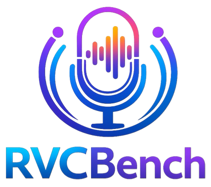
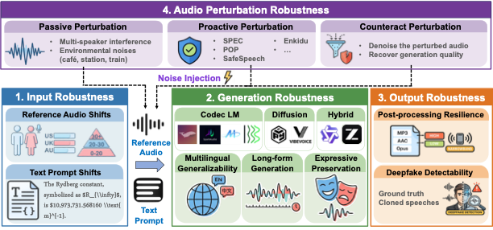

# RVCBench: Benchmarking the Robustness of Voice Cloning


[](https://arxiv.org/abs/2602.00443)
[](https://nanboy-ronan.github.io/RVCBench/)
[](https://arxiv.org/abs/2602.00443)
[](https://huggingface.co/datasets/Nanboy/RVCBench)
[](https://huggingface.co/spaces/Nanboy/RVCBench)
[](LICENSE)
[](https://github.com/Nanboy-Ronan/RVCBench/stargazers)

**News:** RVCBench has been accepted to **NeurIPS 2026**!

RVCBench measures how robust voice cloning (zero-shot text-to-speech) is under realistic deployment
conditions: noisy, accented or overlapping reference audio; irregular or scam text; long-form and
multilingual generation; compression; and anti-cloning protection with and without denoising. The
[paper](https://arxiv.org/abs/2602.00443) defines 18 robustness evaluations over 225 speakers and 14,370
utterances and evaluates 18 open-source models.

[Evaluate your model](#evaluate-your-model) · [What it measures](#what-rvcbench-measures) · [Results](#results-from-the-paper) · [Run this codebase](#getting-started) · [Website](https://nanboy-ronan.github.io/RVCBench/) · [Dataset](https://huggingface.co/datasets/Nanboy/RVCBench) · [Citation](#citation)

> [!NOTE]
> **Two branches.** `main` (this branch, tag [`v1.0`](https://github.com/Nanboy-Ronan/RVCBench/tree/v1.0)) holds the
> codebase before the architecture refactor. [`v2`](https://github.com/Nanboy-Ronan/RVCBench/tree/v2) holds the
> installable `rvcbench` package with versioned evaluation suites, under active development. To evaluate a new
> model, use v2 as shown below; to run this codebase, see [Getting Started](#getting-started).



## Evaluate your model

Generate speech with your own code, in your own environment, and let RVCBench score it. These commands
install the `rvcbench` package from the `v2` branch; they do not use the code on this branch.

```bash
pip install "rvcbench[eval] @ git+https://github.com/Nanboy-Ronan/RVCBench@v2"
rvcbench setup-scorers                                    # once: download the metric models
rvcbench prompts --suite core-v1 --output prompts/        # 480 reference clips and texts
# synthesize each line of prompts/prompts.jsonl and save it at <outputs>/<output_file>
rvcbench score --suite core-v1 --generated outputs/ --model my-model --output results/my-model/ --device cuda
```

`results/my-model/submission.json` reports SIM, MOS, WER and MCD for every evaluation, and the change of
each perturbed condition against its clean counterpart. The suite pins the dataset revision and the hash
of every input, exports only reference audio and texts, and fails a sample whose file is missing or invalid.

- [Core suite](https://github.com/Nanboy-Ronan/RVCBench/blob/v2/docs/core_suite.md): which paper evaluation each task covers, its data and metrics.
- [Evaluate your own model](https://github.com/Nanboy-Ronan/RVCBench/blob/v2/docs/adding_a_model.md): the prompt and output formats, and a one-file
  adapter alternative that lets RVCBench drive your model.
- `core-v1` is not yet a leaderboard suite; baseline results for the paper's models are in progress.

## What RVCBench measures

| Dimension | Paper evaluations | In `core-v1` |
| --- | --- | --- |
| **Input robustness** | Reference-audio shifts across 12 accents, gender and age (RVC-AudioShift); hallucination-style and scam text prompts (RVC-TextShift) | Yes |
| **Generation robustness** | English, Chinese and cross-lingual cloning (RVC-Multilingual); long text and long references (RVC-LongContext); expressive and persuasive speech (RVC-Expression) | Yes; expression scored by emotion consistency |
| **Output robustness** | MP3, AAC, Opus and telephone-band post-processing (RVC-Compression); deepfake detectability (RVC-Detectability) | Compression yes; detectability planned |
| **Perturbation robustness** | Background noise and overlapping speakers (RVC-PassiveNoise); Gaussian noise, SPEC, SafeSpeech, POP and Enkidu protection (RVC-AdvNoise); denoising of protected references (RVC-AntiProtect) | Yes |

Metrics: speaker similarity and verification (SIM, SVA; ECAPA-TDNN), naturalness (MOS; UTMOS via
SpeechMOS), content (WER; Whisper medium), spectral distance (MCD), emotion consistency and intelligibility
under compression (STOI). Real-time factor is recorded but not comparable across models.

## Results from the paper

> [!NOTE]
> **Metric guide** — SIM: speaker cosine similarity ↑ · WER: word error rate ↓ · MOS: SpeechMOS perceptual score ↑ · MCD: mel cepstral distortion ↓ · RTF: real-time factor (< 1 = faster-than-real-time) ↓ · SVA: speaker verification accuracy ↑ · Emo: emotion match rate ↑
>
> **Timing warning:** Historical RTF values have unverified measurement boundaries and execution conditions. They are raw records, cannot rank model speed, and must not inherit current backend scopes. Rank is by SIM.
>
> **Bold** marks the best value per quality column. Reported in the [paper](https://arxiv.org/abs/2602.00443) (arXiv v2) on clean prompts, averaged over each dataset's full speaker set.

### Leaderboard — LibriTTS

| Rank | Model | SIM ↑ | WER ↓ | MOS ↑ | MCD ↓ | RTF (raw, incomparable) | SVA ↑ | Emo ↑ |
|:----:|-------|------:|------:|------:|------:|------:|------:|------:|
| 1 | **Qwen3-TTS** | **0.614** | 0.052 | **4.39** | **5.79** | 2.02 | **0.974** | **0.731** |
| 2 | **IndexTTS** | 0.606 | 0.052 | 4.06 | 6.61 | 2.23 | 0.972 | 0.693 |
| 3 | **CosyVoice 2** | 0.602 | 0.175 | **4.39** | 6.17 | 4.58 | **0.974** | 0.729 |
| 4 | ZipVoice | 0.579 | 0.053 | 4.13 | 7.09 | 1.46 | 0.952 | 0.675 |
| 5 | MaskGCT | 0.570 | 0.088 | 3.93 | 6.91 | 1.36 | 0.939 | 0.682 |
| 6 | GLM-TTS | 0.570 | 0.087 | 4.08 | 6.41 | 1.74 | 0.951 | 0.678 |
| 7 | F5-TTS | 0.559 | 0.116 | 3.99 | 6.96 | 0.61 | 0.937 | 0.676 |
| 8 | Higgs Audio | 0.559 | 0.250 | 4.30 | 6.06 | 1.42 | 0.941 | 0.717 |
| 9 | MGM-Omni | 0.539 | 0.095 | 4.28 | 5.82 | 0.84 | 0.933 | 0.676 |
| 10 | PlayDiffusion | 0.506 | 0.055 | 4.15 | 8.06 | 0.73 | 0.936 | 0.681 |
| 11 | MOSS-TTSD | 0.492 | 0.383 | 4.10 | 7.09 | — | 0.876 | 0.667 |
| 12 | VibeVoice | 0.480 | 0.228 | 3.83 | 6.76 | 1.86 | 0.852 | 0.624 |
| 13 | FishSpeech | 0.472 | 0.166 | 4.37 | 6.47 | 3.61 | 0.907 | 0.682 |
| 14 | XTTS-v2 | 0.454 | 0.073 | 3.81 | 8.62 | 0.62 | 0.908 | 0.639 |
| 15 | SparkTTS | 0.408 | 0.326 | 4.06 | 5.83 | 1.56 | 0.764 | 0.672 |
| 16 | OZSpeech | 0.388 | 0.060 | 3.21 | 6.87 | 8.75 | 0.840 | 0.636 |
| 17 | OpenVoice V2 | 0.244 | 0.075 | 4.30 | 7.06 | 0.08 | 0.474 | 0.601 |
| 18 | StyleTTS 2 | 0.228 | **0.049** | 4.30 | 6.81 | 0.11 | 0.388 | 0.589 |

### Protection Robustness — SIM on LibriTTS

Speaker similarity under each audio protection method. Models sorted by clean SIM. A larger drop from **Clean** indicates more effective protection. **Bold** marks the lowest protected SIM per column (most effectively protected model per method).

| Model | Clean | SafeSpeech | Enkidu | SPEC | Gaussian | POP |
|-------|------:|-----------:|-------:|---------:|---------:|---------:|
| Qwen3-TTS | 0.614 | 0.384 | 0.502 | 0.363 | 0.408 | 0.582 |
| IndexTTS | 0.606 | 0.346 | 0.475 | 0.318 | 0.392 | 0.572 |
| CosyVoice 2 | 0.602 | 0.321 | 0.447 | 0.301 | 0.384 | 0.549 |
| ZipVoice | 0.579 | 0.287 | 0.435 | 0.262 | 0.258 | 0.543 |
| MaskGCT | 0.570 | 0.303 | 0.407 | 0.281 | 0.312 | 0.530 |
| GLM-TTS | 0.570 | 0.330 | 0.445 | 0.311 | 0.388 | 0.532 |
| F5-TTS | 0.559 | 0.207 | 0.431 | 0.176 | 0.137 | 0.520 |
| Higgs Audio | 0.559 | 0.264 | 0.435 | 0.236 | 0.272 | 0.521 |
| MGM-Omni | 0.539 | 0.184 | 0.316 | 0.166 | 0.229 | 0.491 |
| PlayDiffusion | 0.506 | 0.173 | — | 0.149 | 0.162 | 0.466 |
| MOSS-TTSD | 0.492 | 0.242 | 0.335 | 0.216 | 0.247 | 0.453 |
| VibeVoice | 0.480 | 0.272 | 0.367 | 0.253 | 0.280 | 0.442 |
| FishSpeech | 0.472 | 0.238 | 0.334 | 0.212 | 0.235 | 0.439 |
| XTTS-v2 | 0.454 | 0.260 | 0.308 | 0.241 | 0.237 | 0.414 |
| SparkTTS | 0.408 | 0.129 | 0.137 | 0.108 | 0.062 | 0.359 |
| OZSpeech | 0.388 | 0.156 | 0.187 | 0.147 | 0.148 | 0.337 |
| OpenVoice V2 | 0.244 | 0.185 | 0.188 | 0.180 | 0.175 | 0.236 |
| StyleTTS 2 | **0.228** | **0.089** | **0.125** | **0.081** | **0.030** | **0.207** |

<details>
<summary><strong>Cross-Dataset Generalisation — SIM across all 10 datasets (click to expand)</strong></summary>

Speaker similarity (SIM) on clean prompts across all benchmark datasets. — indicates the model was not evaluated on that dataset.

| Model | LibriTTS | VCTK | Multi-spk | Long | AISHELL | French | Bilingual | BG-clean | BG-noise | Hallucin. |
|-------|------:|------:|------:|------:|------:|------:|------:|------:|------:|------:|
| Qwen3-TTS | 0.614 | 0.618 | 0.495 | 0.561 | **0.721** | **0.536** | **0.673** | **0.689** | **0.572** | 0.515 |
| IndexTTS | 0.606 | 0.567 | 0.473 | **0.775** | **0.721** | 0.397 | **0.673** | 0.589 | 0.528 | 0.529 |
| CosyVoice 2 | 0.602 | **0.582** | 0.448 | 0.530 | 0.717 | 0.378 | 0.653 | 0.626 | 0.515 | 0.518 |
| ZipVoice | 0.579 | 0.554 | **0.531** | 0.729 | 0.712 | 0.363 | 0.322 | 0.625 | 0.462 | 0.509 |
| MaskGCT | 0.570 | 0.555 | 0.431 | 0.194 | 0.674 | 0.494 | — | 0.610 | 0.487 | 0.499 |
| GLM-TTS | 0.570 | 0.573 | 0.445 | 0.757 | 0.690 | 0.398 | 0.657 | 0.622 | 0.528 | **0.533** |
| F5-TTS | 0.559 | 0.537 | 0.507 | 0.607 | 0.696 | 0.304 | 0.653 | 0.582 | 0.414 | 0.455 |
| Higgs Audio | 0.559 | 0.516 | 0.418 | 0.520 | 0.581 | 0.349 | 0.543 | 0.592 | 0.421 | 0.425 |
| MGM-Omni | 0.539 | 0.447 | 0.370 | 0.442 | 0.713 | 0.227 | 0.630 | 0.523 | 0.332 | 0.396 |
| PlayDiffusion | 0.506 | 0.426 | 0.360 | 0.637 | 0.441 | 0.283 | 0.465 | 0.433 | 0.305 | 0.408 |
| MOSS-TTSD | 0.492 | 0.440 | 0.379 | 0.644 | 0.437 | 0.327 | 0.471 | 0.494 | **0.488** | 0.416 |
| VibeVoice | 0.480 | 0.436 | 0.348 | 0.625 | 0.564 | 0.343 | 0.531 | 0.513 | 0.364 | 0.408 |
| FishSpeech | 0.472 | 0.430 | 0.383 | 0.572 | 0.611 | 0.374 | 0.566 | 0.495 | 0.387 | 0.351 |
| XTTS-v2 | 0.454 | 0.454 | 0.328 | 0.613 | 0.569 | **0.445** | 0.506 | **0.546** | 0.394 | **0.488** |
| SparkTTS | 0.408 | **0.532** | 0.228 | 0.345 | 0.569 | 0.164 | 0.480 | 0.588 | 0.332 | 0.336 |
| OZSpeech | 0.388 | 0.253 | 0.271 | — | — | 0.109 | — | 0.272 | 0.164 | 0.281 |
| OpenVoice V2 | 0.244 | 0.392 | 0.192 | 0.278 | 0.431 | 0.271 | 0.298 | 0.484 | 0.358 | 0.365 |
| StyleTTS 2 | 0.228 | 0.236 | 0.162 | — | — | — | 0.213 | 0.196 | 0.166 | 0.184 |

</details>

## Getting Started

This section runs the code on this branch (v1). It covers 32 model integrations, 5 protection methods
and 10 dataset configurations.

### Requirements

- Python 3.9+
- PyTorch ≥ 2.0 with CUDA
- `hydra-core`, `omegaconf`, `pandas`, `pyarrow`, `soundfile`, `librosa`
- Model-specific packages. Many models need mutually incompatible dependency stacks, so launch each model
  from its environment in [`envs/`](envs/); see [docs/model_environments.md](docs/model_environments.md).

### Installation

```bash
git clone https://github.com/Nanboy-Ronan/RVCBench.git
cd RVCBench
pip install hydra-core omegaconf pandas pyarrow soundfile librosa \
            jiwer openai-whisper pymcd huggingface_hub
```

For model-specific runs, use the Conda environment files:

```bash
conda env create -f envs/qwen3-tts.yml
conda activate qwen3
```

Model checkpoints and third-party inference code are not bundled; see [Data & Checkpoints](#data--checkpoints).

## Quickstart Path

Three notebooks run small end-to-end examples and download the selected speakers from the Hugging Face
dataset. Outputs are written inside the repository directory.

| Example | Notebook | Environment |
| --- | --- | --- |
| Qwen3-TTS zero-shot cloning on LibriTTS | [`notebooks/rvcbench_qwen3tts_quickstart.ipynb`](notebooks/rvcbench_qwen3tts_quickstart.ipynb) | `qwen3` |
| FishSpeech zero-shot cloning on VCTK | [`notebooks/rvcbench_fishspeech_quickstart.ipynb`](notebooks/rvcbench_fishspeech_quickstart.ipynb) | FishSpeech environment |
| Gaussian noise or SafeSpeech protection, then Qwen3-TTS | [`notebooks/rvcbench_safespeech_qwen3tts_quickstart.ipynb`](notebooks/rvcbench_safespeech_qwen3tts_quickstart.ipynb) | `qwen3` |

Model setup for the quickstarts, including gated downloads, is in
[docs/quickstart_model_setup.md](docs/quickstart_model_setup.md). Command-line versions of these
quickstarts are on the `v2` branch.

## Full Benchmark Path

All entry points use [Hydra](https://hydra.cc); any config value can be overridden on the command line.

```text
source audio → [protection] → [denoising] → voice cloning → evaluation
```

```bash
# 1. Apply protection and evaluate fidelity
python run_protect.py --config-name safespeech_on_libritts

# 2. Zero-shot voice cloning on clean prompts
python run_vc.py --config-name ots_vc/clean/libritts/qwen3_tts_ots adversary.max_samples=50 dataset.speaker_id=1089

# 3. Voice cloning on protected prompts
python run_vc_protect.py --config-name ots_vc/protection/safespeech/ozspeech_ots \
    protected_audio_dir=results/safespeech_on_libritts/<timestamp>/protected_audio

# 4. Optionally denoise protected audio and re-evaluate
python run_denoiser.py --config-name denoise/denoiser_dns64_on_protected_libritts_spec
```

### Running specific models

<details>
<summary><strong>One-model workflow, examples, model-specific notes and server-backed models</strong></summary>

The zero-shot VC configs are under `configs/ots_vc/clean/`. All LibriTTS model integrations now use the canonical `configs/ots_vc/clean/libritts/` directory.

Before launching a model, activate the matching environment from
[`envs/`](envs/). See [docs/model_environments.md](docs/model_environments.md) for the full map.

### If You Only Want One Model

You do not need to download every checkpoint bundle. For a single model, the workflow is:

1. Pick the Hydra config for that model under `configs/ots_vc/clean/...`.
2. Create and activate that model's environment from `envs/`.
3. Download or install only that model's runtime and checkpoints.
4. Point any local paths with Hydra overrides such as `adversary.code_path=...` or `adversary.checkpoint_path=...`.
5. Run `run_vc.py` against the dataset/config you want.

Generic pattern:

```bash
python run_vc.py --config-name <model_config> \
  dataset.speaker_id=<speaker_id> \
  adversary.max_samples=<n>
```

If the model needs a local repo checkout or checkpoint directory:

```bash
python run_vc.py --config-name <model_config> \
  dataset.speaker_id=<speaker_id> \
  adversary.code_path=/path/to/model_repo \
  adversary.checkpoint_path=/path/to/checkpoint_or_hf_id
```

Concrete examples:

```bash
# Qwen3-TTS only
python -m pip install -U qwen-tts
huggingface-cli download Qwen/Qwen3-TTS-12Hz-1.7B-Base \
  --local-dir checkpoints/Qwen3-TTS-12Hz-1.7B-Base
python run_vc.py --config-name ots_vc/clean/libritts/qwen3_tts_ots \
  dataset.speaker_id=1089 \
  adversary.checkpoint_path=checkpoints/Qwen3-TTS-12Hz-1.7B-Base

# FishSpeech only
git clone https://github.com/fishaudio/fish-speech.git checkpoints/fish_speech
huggingface-cli download fishaudio/s1-mini \
  --local-dir checkpoints/fish_speech/openaudio-s1-mini
python run_vc.py --config-name ots_vc/clean/vctk/fishspeech_ots \
  dataset.speaker_id=p226 \
  adversary.code_path=checkpoints/fish_speech \
  adversary.llama_checkpoint_path=checkpoints/fish_speech/openaudio-s1-mini \
  adversary.decoder_checkpoint_path=checkpoints/fish_speech/openaudio-s1-mini/codec.pth
```

For the full command list for the quickstart models, see
[docs/quickstart_model_setup.md](docs/quickstart_model_setup.md).

### Additional Examples

```bash
# FireRedTTS-2
python run_vc.py --config-name ots_vc/clean/libritts/fireredtts2_ots

# VoxCPM
python run_vc.py --config-name ots_vc/clean/libritts/voxcpm_ots

# dots.tts (conda env: dots-tts)
python run_vc.py --config-name ots_vc/clean/libritts/dots_tts_ots device=cuda:<gpu>

# MOSS-TTS (conda env: moss-tts)
python run_vc.py --config-name ots_vc/clean/libritts/moss_tts_ots device=cuda:<gpu>

# ZONOS2 (uv-managed env; run with its own interpreter, GPU pinned via CUDA_VISIBLE_DEVICES)
CUDA_VISIBLE_DEVICES=<gpu> checkpoints/ZONOS2-repo/.venv/bin/python run_vc.py \
  --config-name ots_vc/clean/libritts/zonos2_ots
```

### Model-specific setup notes

- `Qwen3-TTS` can use either the Hugging Face model ID `Qwen/Qwen3-TTS-12Hz-1.7B-Base` directly or a local directory passed via `adversary.checkpoint_path=...`. It also needs the `qwen-tts` Python package.
- `FishSpeech` needs both a local checkout of `fishaudio/fish-speech` and the `fishaudio/s1-mini` checkpoint directory. Pass them with `adversary.code_path=...`, `adversary.llama_checkpoint_path=...`, and `adversary.decoder_checkpoint_path=...`.
- `Fish Audio S2` ([paper](https://arxiv.org/abs/2603.08823)) reuses the same `fishaudio/fish-speech` checkout as `FishSpeech`, pointed at the `fishaudio/s2-pro` checkpoint instead of `s1-mini`. S2 uses a different dual-AR decoder architecture than S1; the wrapper defaults `decoder_config_name` to `modded_dac_vq` as a best-effort setting that has not been validated against a downloaded `s2-pro` checkpoint — see [docs/quickstart_model_setup.md](docs/quickstart_model_setup.md#4-fish-audio-s2-quickstart).
- `FireRedTTS-2` expects a local upstream checkout at `checkpoints/FireRedTTS2` and pretrained weights under `checkpoints/FireRedTTS2/pretrained_models/FireRedTTS2` by default.
- `VoxCPM` defaults to the Hugging Face model ID `openbmb/VoxCPM2`. If you want to force offline/local loading, override `adversary.local_files_only=true` and optionally set `adversary.cache_dir=/path/to/cache`.
- `dots.tts` (`rednote-hilab/dots.tts-soar`, pip-installable) needs its own env (`envs/dots-tts.yml`, see the file for the exact install order — it requires `torch>=2.8.0`, newer than the repo-wide `requirements.txt` pin). `device: cuda:N` is honoured.
- `MOSS-TTS` (`OpenMOSS-Team/MOSS-TTS-v1.5`, plain `transformers` + `trust_remote_code`) also needs its own env (`envs/moss-tts.yml`; see the file for the sequential pip-install order — installing everything in one shot fails to resolve).
- `ZONOS2` (`Zyphra/ZONOS2`) is not pip-installable; it's a `uv`-managed project (see `envs/zonos2.yml` for the clone + `uv sync` setup steps). Its `TTSLLM` scheduler ignores `device: cuda:N` — pin the GPU with `CUDA_VISIBLE_DEVICES` instead — and it pre-allocates a large KV cache (~55GB on an 80GB A100), so run it alone on its GPU.
- `dots.tts`, `ZONOS2`, and `MOSS-TTS` each route the sample's `target_language` into the model runtime, which matters for AISHELL, French, and mixed-direction cross-lingual configs.
- `Fish Audio S2` (local API server) and `Higgs TTS 3` talk to a locally running inference server instead of loading weights in-process — see [Server-backed models](#server-backed-models-fish-audio-s2-and-higgs-tts-3) below.
- All model-specific paths and generation knobs can be overridden at launch time with Hydra, for example: `adversary.code_path=/path/to/model_repo` or `adversary.max_samples=20`.

### Server-backed models: Fish Audio S2 and Higgs TTS 3

Unlike the other adversaries, these two don't load weights in-process — they call
a local HTTP server (`adversary.endpoint_url` in the config), so you start the
server first and then point `run_vc.py` at it.

**Fish Audio S2** (`fishaudio/s2-pro`, served via Fish Speech's `/v1/tts` API):
```bash
git clone https://github.com/fishaudio/fish-speech.git checkpoints/fish_speech
conda env create -f envs/fish-speech-s2.yml
conda activate fish-speech-s2
uv pip install 'numba==0.63.1' 'llvmlite==0.46.0'
cd checkpoints/fish_speech
uv pip install -e '.[cu126]'
uv pip install 'protobuf>=6.31.1,<7'
cd ../..
hf download fishaudio/s2-pro --local-dir checkpoints/s2-pro
CUDA_VISIBLE_DEVICES=<gpu> python checkpoints/fish_speech/tools/api_server.py \
  --llama-checkpoint-path checkpoints/s2-pro \
  --decoder-checkpoint-path checkpoints/s2-pro/codec.pth \
  --listen 0.0.0.0:8001 --half
# in another shell, from the benchmark (audiobench) env — needs the `ormsgpack` dep in requirements.txt:
python run_vc.py --config-name ots_vc/clean/libritts/fish_audio_s2_ots
```

**Higgs TTS 3** (`bosonai/higgs-tts-3-4b`, served via vLLM-Omni's OpenAI-compatible `/v1/audio/speech` API):
```bash
conda env create -f envs/vllm-omni-cu129.yml
conda activate vllm-omni-cu129
uv pip install --torch-backend=cu129 --extra-index-url https://wheels.vllm.ai/0.24.0/cu129 vllm==0.24.0
uv pip install --torch-backend=cu129 vllm-omni==0.24.0
hf download bosonai/higgs-tts-3-4b
CUDA_VISIBLE_DEVICES=<gpu> vllm-omni serve bosonai/higgs-tts-3-4b \
  --host 0.0.0.0 --port 8000 --trust-remote-code --omni \
  --allowed-local-media-path "$(pwd)"
# in another shell, from the benchmark env:
python run_vc.py --config-name ots_vc/clean/libritts/higgs_tts3_ots
```

Both server configs default `device: cpu` at the top level (the client-side
process does no GPU work) with `evaluation.device: cuda:0` for the metrics
pass; point the server itself at a GPU via `CUDA_VISIBLE_DEVICES` as shown above.

**Known metric gaps in the `dots-tts`, `moss-tts`, and `zonos2` envs** (env
version conflicts, not model properties — see the `emotion_pairs` /
`speechmos_pairs` fields in each run's `metrics.json`):
- `dots-tts`, `moss-tts`: `emotion_pairs: 0` — the bundled speechbrain emotion
  recognizer needs `AutoModelWithLMHead`, which is removed in the
  `transformers` version these models require.
- `zonos2`: `speechmos_pairs: 0`, `emotion_pairs: 0` — `torchcodec` fails to
  load its native library against this env's torch/ffmpeg combination, so the
  `torchaudio.load_with_torchcodec` path used for those two metrics fails.
  WER, MCD, SIM, DNSMOS, and DNSMOS-C are unaffected.

### Example overrides

```bash
python run_vc.py --config-name ots_vc/clean/libritts/fireredtts2_ots \
    adversary.max_samples=20 \
    dataset.speaker_id=1089

python run_vc.py --config-name ots_vc/clean/libritts/voxcpm_ots \
    adversary.local_files_only=true \
    adversary.cache_dir=/path/to/hf-cache
```

</details>

## Supported Models

<details>
<summary><strong>Voice cloning models (32 integrations)</strong></summary>

RVCBench currently includes wrappers or configs for **32 VC/TTS adversary models**:

| Model | Key |
|---|---|
| BertVITS2 | `bert` |
| Qwen3-TTS | `qwen3_tts` |
| Qwen3-Omni | `qwen3_omni` |
| FireRedTTS-2 | `fireredtts2` |
| VoxCPM | `voxcpm` |
| F5-TTS | `f5_tts` |
| MaskGCT | `maskgct` |
| OpenVoice V2 | `openvoice` |
| Coqui XTTS-v2 | `xtts` |
| IndexTTS | `index_tts` |
| ZipVoice | `zipvoice` |
| FishSpeech | `fishspeech` |
| Fish Audio S2 (in-process, via FishSpeech checkout) | `fishspeech_s2` |
| Fish Audio S2 (local API server) | `fish_audio_s2` |
| CosyVoice / CosyVoice 2 | `cosyvoice` |
| Higgs Audio | `higgs_audio` |
| Higgs TTS 3 (local API server) | `higgs_tts_3` |
| SparkTTS | `sparktts` |
| VALL-E | `vall_e` |
| StyleTTS 2 | `styletts2` |
| GLM-TTS | `glm_tts` |
| GlowTTS | `glowtts` |
| Kimi Audio | `kimi_audio` |
| MGM-Omni | `mgm_omni` |
| MOSS TTSD | `moss_ttsd` |
| MOSS-TTS | `moss_tts` |
| dots.tts | `dots_tts` |
| ZONOS2 | `zonos2` |
| PlayDiffusion | `playdiffusion` |
| Bark Voice Clone | `bark_voice_clone` |
| OZSpeech | `ozspeech` |
| VibeVoice | `vibevoice` |

</details>

### Protection methods

| Method (paper name) | Config | Description |
| --- | --- | --- |
| Gaussian noise | `grnoise_on_libritts` | Gaussian random noise; no surrogate model required |
| SPEC | `spec_on_libritts` | SafeSpeech's spectral perturbation mode |
| SafeSpeech | `safespeech_on_libritts` | Adversarial perturbation optimised against a surrogate VC model |
| POP | `em_on_libritts` | Implemented as the error-minimizing protector `em` |
| Enkidu | `enkidu_on_libritts` | Perceptual-loss adversarial perturbation |

### Datasets

The public Hugging Face dataset release exposes **10 benchmark dataset configurations**:

| Dataset config | Typical use |
|---|---|
| `Libritts` | English zero-shot VC/TTS benchmark prompts |
| `VCTK` | Multi-speaker English voice cloning |
| `Multispeaker_libri` | Multi-speaker LibriSpeech-style evaluation |
| `Long_context` | Longer-context voice cloning prompts |
| `AISHELL1_dev` | Mandarin speech evaluation |
| `CommonVoiceFR_dev` | French speech evaluation |
| `Bilingual_uedin` | Bilingual speech evaluation |
| `Background_noise` | Noisy prompt robustness |
| `robotcall` | Robocall-style speech robustness |
| `vctk_text_robust` | Text robustness on VCTK-style prompts |

## Data & Checkpoints

### Benchmark dataset

The benchmark dataset is publicly available on Hugging Face. The data loader fetches it automatically when `use_hf_dataset: true` (the default in all dataset configs).

👉 **[Nanboy/RVCBench on Hugging Face](https://huggingface.co/datasets/Nanboy/RVCBench)**

A static snapshot is also available for offline use:

👉 **[Download via Google Drive](https://drive.google.com/file/d/1ZDOMorDGV8i5oVNtA5BaJLbFj2dVo5AU/view?usp=drive_link)**

### Model checkpoints

Each VC adversary requires its own inference code and pretrained weights. Clone the relevant repository into `checkpoints/` and verify the paths in the corresponding config under `configs/`.

A bundled archive with all supported model code and checkpoints is available here:

👉 **[Download pretrained checkpoints](https://object-arbutus.alliancecan.ca/swift/v1/86581f3bb67c4c04bbccbcb839de730a/rjin/AudioBench/checkpoint.zip)** (~58 GB)

If you only need a single model, cloning just that repository is the fastest option.

<details>
<summary><strong>Dataset format</strong></summary>

Each dataset follows a canonical layout:

```text
data/<dataset>/
├── audios/
│   └── <speaker_id>/*.wav
├── filelists/          # legacy per-speaker JSON manifests (kept for compatibility)
└── metadata.parquet    # canonical manifest used by all loaders
```

`metadata.parquet` stores one row per benchmark pair with the following columns:

| Column | Description |
|---|---|
| `speaker_id` | Target speaker identifier |
| `prompt_file_name` | Path to the prompt (reference) audio |
| `prompt_text`, `prompt_language` | Transcript and language of the prompt |
| `target_file_name` | Path to the ground-truth target audio |
| `target_text`, `target_language` | Transcript and language of the target |
| `pair_id`, `dataset_name`, `split` | Provenance fields |

Training-oriented phoneme and alignment annotations (`prompt_phonemes`, `prompt_tone`, `prompt_word2ph`, and their `target_*` counterparts) are preserved when available. Dataset-specific fields (e.g., `spam_type` in `robotcall`) are carried as additional columns.

To rebuild canonical manifests from legacy per-speaker JSON files:

```bash
python src/datasets/build_canonical_manifests.py --force
```

Dataset selection and `speaker_id` filtering continue to work through `configs/dataset/` as before.

</details>

## Repository Structure

```text
RVCBench/
├── run_vc.py                  # voice cloning on clean prompts
├── run_protect.py             # apply protection + fidelity evaluation
├── run_vc_protect.py          # voice cloning on protected prompts
├── run_denoiser.py            # denoise protected audio + re-evaluate
├── configs/
│   ├── dataset/               # dataset configs (root_path, sampling_rate, …)
│   ├── model/                 # surrogate model configs for protection
│   ├── ots_vc/                # zero-shot VC configs (clean / protected)
│   └── denoise/               # denoiser configs
├── src/
│   ├── adversary/             # VC adversary wrappers
│   ├── protection/            # protection algorithm implementations
│   ├── datasets/              # dataset loaders and manifest utilities
│   ├── evaluation/            # fidelity and generation-quality metrics
│   ├── models/                # model generator wrappers
│   └── workflows/             # end-to-end pipeline orchestration
├── notebooks/                 # quickstart notebooks and runnable example scripts
└── data/                      # local dataset folders (populated at runtime)
```

<details>
<summary><strong>Outputs and configuration</strong></summary>

### Outputs

Each run writes a timestamped directory under `results/`:

```text
results/<run_name>/<timestamp>/
├── generated_audio/            # cloned audio files (VC runs)
├── protected_audio/            # perturbed audio files (protection runs)
├── perturbed_noise/            # saved perturbation tensors
├── generation_sample_metrics.csv
├── fidelity_sample_metrics.csv
└── metrics.json                # aggregated metrics with bootstrap CIs
```

`metrics.json` contains fidelity metrics (SNR, STOI, MCD, WER, MOS, speaker similarity) for protection and denoising runs, and generation-quality metrics (MCD, WER, speaker similarity, MOS, emotion match rate, RTF) for VC runs.

### Configuration

All configs use [Hydra](https://hydra.cc). Any field can be overridden from the command line:

```bash
python run_vc.py --config-name ots_vc/clean/libritts/qwen3_tts_ots \
    device=cuda:1 \
    adversary.max_samples=100 \
    dataset.speaker_id=1089 \
    dataset.use_hf_dataset=false \
    dataset.root_path=/path/to/local/data
```

Key config locations:

| Path | Controls |
|---|---|
| `configs/dataset/` | Dataset root, sampling rate, speaker selection |
| `configs/ots_vc/` | VC model, generation hyperparameters, evaluation settings |
| `configs/model/` | Surrogate model used during protection |
| `configs/denoise/` | Denoiser model and paths |

</details>

## Contributing

Contributions are welcome, especially new models, protection methods, datasets and metrics. New work
happens on the [`v2`](https://github.com/Nanboy-Ronan/RVCBench/tree/v2) branch; see its
[contributing guide](https://github.com/Nanboy-Ronan/RVCBench/blob/v2/CONTRIBUTING.md). Open an issue or pull request on GitHub, or contact
**ruinanjin@alumni.ubc.ca**.

## Citation

```bibtex
@inproceedings{jin2026rvcbench,
  title     = {RVCBench: Benchmarking the Robustness of Voice Cloning Across Modern Audio Generation Models},
  author    = {Jin, Ruinan and Liao, Xinting and Yu, Hanlin and Pandya, Deval and Li, Xiaoxiao},
  booktitle = {Advances in Neural Information Processing Systems},
  url       = {https://arxiv.org/abs/2602.00443},
  year      = {2026}
}
```

## License

[CC0-1.0](LICENSE). Model checkpoints, upstream code and source corpora keep their own licenses.
